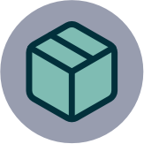

[webpage]: https://bitfunk.github.io/gradle-plugins/
[repository]: https://github.com/bitfunk/gradle-plugins
[issues]: https://github.com/bitfunk/gradle-plugins/issues
[releases]: https://github.com/bitfunk/gradle-plugins/releases



# Bitfunk Gradle Plugins

Collection of Gradle plugins to simplify and unify project development.

[Explore the docs »][webpage]

[Report Bug]() | [Request Feature]()

[][releases]
[](LICENSE)

## About the project

Collection of Gradle plugins used across multiple projects. They add opinionated configuration for other plugins or add new functionality.

### Plugins

List of plugins:

* Plugin development
  * VersionCatalogAccessor - a version catalog accessor for Gradle plugin development

## Getting started

You could use individual plugins or the all-plugins collection.

Check the usage of each Gradle plugin by reading the [documentation][webpage].

### Requirements

* Gradle 7.2+
* Java 11

## Installation

```
TODO
```

## Usage

```
TODO
```

For more examples, please refer to the [documentation][webpage] and each individual plugin.

## Roadmap

This project is work in progress. We are working on adding more functionality, guidelines,
documentation and other improvements.

See the open [issues][issues] for a list of proposed improvements and known issues.

## Changelog

All notable changes to this project will be documented in the [changelog](CHANGELOG.md).

## Versioning

We use [Semantic Versioning](http://semver.org/) as a guideline for our versioning.

## Contributing

You want to help or share a proposal? You have a specific problem? You want to fix or change code? 
Read the [contributing guide](docs/src/develop/contributing.md).

## Releasing

See [releasing](docs/src/develop/releasing.md)

## Copyright and license

Copyright (c) 2022 Wolf-Martell Montwé.

Please refer to the [ISC License](LICENSE) for more information.
