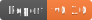

# Report Plugin

[](https://central.sonatype.dev/namespace/eu.bitfunk.gradle.plugin.quality.report)

The plugin configures sonarqube scanner to report code metrics to [sonarcloud.io](https://sonarcloud.io). It makes use of the [SonarScanner for Gradle](https://docs.sonarqube.org/latest/analysis/scan/sonarscanner-for-gradle/) and applies default configuration.

## Features

This plugin wraps the sonar scanner Gradle plugin and applies some configuration. It also collects project sourceFiles for the report. This works for subprojects and included builds. It also copies code coverage reports to the right location for the scanner plugin.

## Installation

Add the following to your project root `build.gradle/build.gradle.kts` file:

```kotlin
plugins {
    id("eu.bitfunk.gradle.plugin.quality.report")
}
```

The plugin needs some configuration:

- **_sonarProjectKey_**: Sonar key used to identify the project.
- **_sonarOrganization_**: Sonar organisation name the project belongs to.
- **_coverageReportSourceDirs_**: List of directories in which the jacoco coverage report XML file could be found. Default: `buildDir/reports/jacoco/testCodeCoverageReport`

```kotlin
reportConfig {
    sonarProjectKey.set("sonar project key")
    sonarOrganization.set("sonar organization name")
    coverageReportSourceDirs.set(listOf("buildDir/reports/jacoco/testCodeCoverageReport")) // Optional
}
```

## Usage

To run the report generation and upload to sonarcloud.io:

```bash
./gradlew sonarqube
```

You need to provide a `SONAR_TOKEN` from [sonarcloud.io](https://sonarcloud.io) to be able to upload reports.
